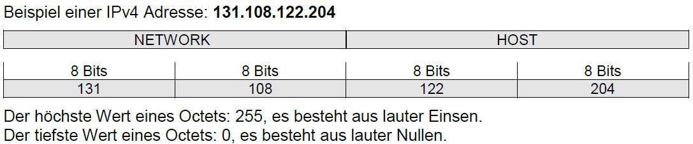
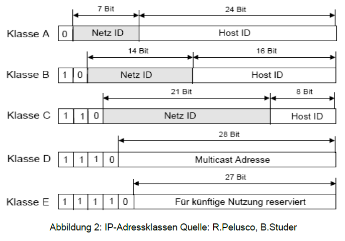
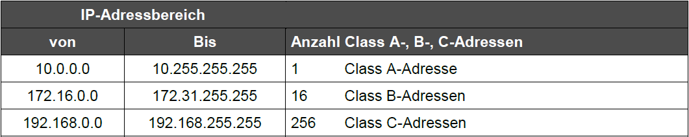

# IP
[back to index](index.md)
> IP entstehung 1974

IP ist verbindungslos, es ist packetübermittlung, hat die aufgabe  den weg zwischen A und B zu finden

hat keine Fehler erkennung, ist in schicht 2 und 4 im OSI

32bit grosse adresse

## Spezielle IP-Adressen

Folgende IP-Adressen haben eine besondere Bedeutung und dürfen keinem Host zugewiesen werden, weder manuell noch über einen DHCP Server.
* **0.0.0.0/8**	stellvertretend für die Standardroute (default gateway)
* **127.0.0.0/8** Adressbereich für Loopback gleichbedeutend mit dem Namen localhost (Testen der Installation, lokale Anwendungen)
* **x.x.x.255/24** wenn alle Bits des Hostanteils auf 1 gesetzt sind handelt es sich um eine Broadcast-Adresse.
  Die Datenpakete werden also an alle Hosts des Netzes gesandt. (in andere Netze werden Broadcasts nicht gerouted)
* **255.255.255.255** sog. eingeschränkte Broadcast-Adresse. Wird z.B. von BOOTP verwendet. Die Netzadresse muss nicht bekannt sein.
* **x.x.x.0/24** wenn alle Bits des Hostanteils auf 0 gesetzt sind, ist das Netz gemeint Hier am Beispiel einer C-Klasse. Bei einer B-Klasse sieht es dann so aus: x.x.0.0/16. So werden die Netzadressen in Routingtabellen eingetragen.
* **169.254.0.0/16** (169.254.0.0 - 169.254.255.255) Diesen Adressbereich hat die IANA für Automatic Private IP Addressing (APIPA) reserviert. Windows Hosts (ab W98) konfigurieren sich eine eigene IP-Adresse, wenn der DHCP nicht erreicht wird. APIPA gibt es auch für Linux und ist unter zeroconf zu finden.

Aufgrund dieser Einschränkungen kann es also nur 126 Klasse-A Netze geben. 1. Bit wird für die Identifizierung der Klasse-A verwendet. Es bleiben also noch 7 Bit. 27 = 128 theoretisch mögliche Netzadressen, minus Standardroute (alle Bit=0) minus Loopback = 126 effektiv mögliche Klasse-A Netze.

## Private IP-Adressen

Vor der Einführung privater IP-Adressen wurde für jeden Teilnehmer eines TCP/IP Netzwerks eine offiziell registrierte IP-Adresse benötigt. Solange ein Netz nicht an das Internet angeschlossen war konnte man sich zwar darüber hinwegsetzen und sich einfach eine IP-Adresse aneignen, sobald aber ein Internetanschluss benötigt wurde, musste eine offizielle IP-Adresse beantragt und alle Hosts umadressiert werden.
Durch die rasante Verbreitung des Internets wurden entsprechend viele IP-Adressen verbraucht. Das führte zur Befürchtung, dass uns die IP-Adressen schnell ausgehen werden (IP-Adresskrise). Ein erfolgreicher Lösungsansatz war die „Erfindung“ sog. privater IP-Adressen. (RFC 1918, Februar 1996)

