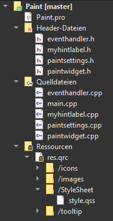

# QT GUI

[back to index](index.md)

## QRC erstellen und QSS laden

Damit wir eine QSS Datei aus den Resourcen laden können, müssen wir als erstes die Resourcendatei erstellen (.qrc).

Anschliessen muss man einen Präfix erstellen, in meinemfalle **/StyleSheet** und diesem Präfix die *.qss Datei zuweisen.

dies sieht dan folgendermassen aus:

 Note: Bei jeder änderung in der qss datei, **muss** das Projekt neu erstellt werden!


## Design Theme aus *.qss laden

*main.cpp*

``` cpp
#include "paintwidget.h"
#include <QApplication>
#include <QFile>
#include <QStyleFactory>

int main(int argc, char *argv[]) {
	QApplication a(argc, argv);
	paintWidget w;
    //---- Lade QSS in einen QString
	QFile file(":/StyleSheet/style.qss");
	file.open(QFile::ReadOnly);
	QString styleSheet = QLatin1String(file.readAll());
    //---- Setze das geladene QSS als Application StyleSheet
	a.setStyleSheet(styleSheet);
    
	w.show();
	return a.exec();
}
```

note: Wen man an dem QSS eine änderung vornimt, so **muss** man das Projekt **neu erstellen**. ansonsten werden die änderungen nicht angezeigt.

Note: fsfds
