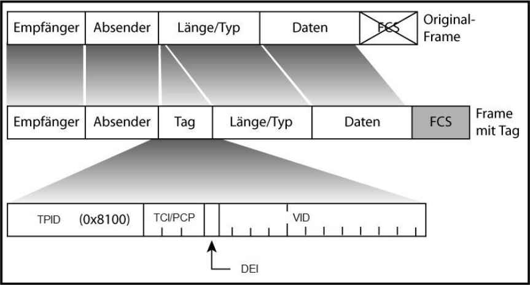
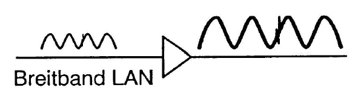
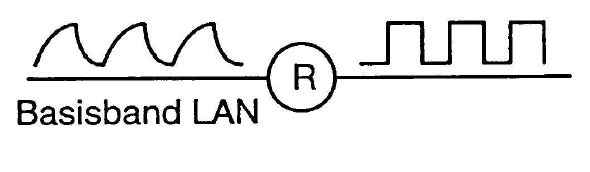

<!-- TITLE: Netzwerk Prüfung -->
<!-- SUBTITLE: Infos zur Net Prüfung -->

## Was ist Vlan

> Virtuelle LAN

Ein **VLAN** unterteilt ein Netzwerk in **abgeschirmte Segmente** und sorgt so für **mehr Sicherheit**.

## Wozu braucht es Vlan

> Logische Gruppen statt physikalische Segmente

Um Gruppen von Benutzern logisch zusammenzufassen. So werden z.B.: Arbeiter vom Marketing zu Mitgliedern eines Marketing-VLANs gemacht.

Dies ermöglicht die Filterung von Broadcasts und bietet Sicherheit und ein Datenflussmanagement. 

## VLAN Tagging (Frame-Tagging)

Die Frame-Header werden gekapselt oder modifiziert um die Frames mit einer VLAN-Kennung zu markieren. Vor der Weiterleitung zum Endgerät wird der Header wider in seine Ursprüngliche Form gebracht.

Mit dieser VLAN-Kennung wird logisch ermittelt, welche Pakete zu welcher VLAN-Gruppe gehören.

Es gibt mehrere solche Bündlungsmethoden **auch Trunking** genannt.

| Kürzel | Beschreibung |
| :----------------------------------- | :----------------------------------------------------------- |
| **TPID** **-** Tag Protocol Identifier : | Fester Wert 8100hex. Frame trägt die 802.1Q Information. |
|         **TCI** **-** Tag Control Information:TCI **-** Tag Control Information:                         | **PCP** - Priority Code Point: Benutzer-Prioritätsinformationen. |
| **DEI** **-** Drop Eligible Indicator: | Kann seperat oder in Verbindung mit PCP verwendet werden, um anzuzeigen, dass Frames in der Gegenwart von Staus fallen gelassen werden können (ehemals CFI). |
| **VID** **-** VLAN-Identifier:       | Identifizierung des VLANs, zu dem der Frame gehört.          |

​		

## Können Vlan unteerinander Kommunizieren (Layer 3)

Für eine Kommunikation unter den VLANs müssen diese über einen Layer 3 verfügen (Vermittlungsschicht).

## Unterschied Repeater und Verstärker

### Verstärker

Die Aufgabe des Verstärkers, ist die Signale zu verstärken. Einsatz in Breitbandnetzen. 

Note: Hier werden auch fehlerhafte Signale verstärkt!

### Repeater

Der Repeater **regeneriert** die Signale, welche durch Induktiviäten und Kapazitäten (Übertragungstechnik) verändert wurden. Das Signal wird wieder sauber aufbereitet und in der ursprünglichen Form auf das Übertragungsmedium gelegt. Einsatz in Basisband-Lan

## zugriffsverfahren (wie wird auf das Netz zugegeriffen)
## jam sequenz
## min max blocklänge (warum)
## csma/cd und der duplex modus
## 4.1 Mac Rahmen Ethernet DIX V2.0 (Felder kennen)
## wan braucehn wir 4 drähte und wan 8? für 1 gb bracuhts 8
## warum und wan muss man kreuzen

# thema switch

## layer 2 switch
## wie feunktioniert und was ist die aufgabe eines layer 2 switches (port macaddresse)
## looding, broatcaast an alle etc
## methoden zum switchen
## 2.2.2.1
## 2.2.2.2
## spanning tree (beurteilen welcher switch wird root bridge etc. anhand einer config beurteilen ob und wie es funktioniert
## es gibt kosten die festgelegt werden, anhand der wird der weg festgelegt
## Beim starten
### Blocking
### listening
### learning
## Bridgeproiotyti
## designatet port
## Sicherheit lesen
### flooting spoofing
### wie schützt man einen switch
