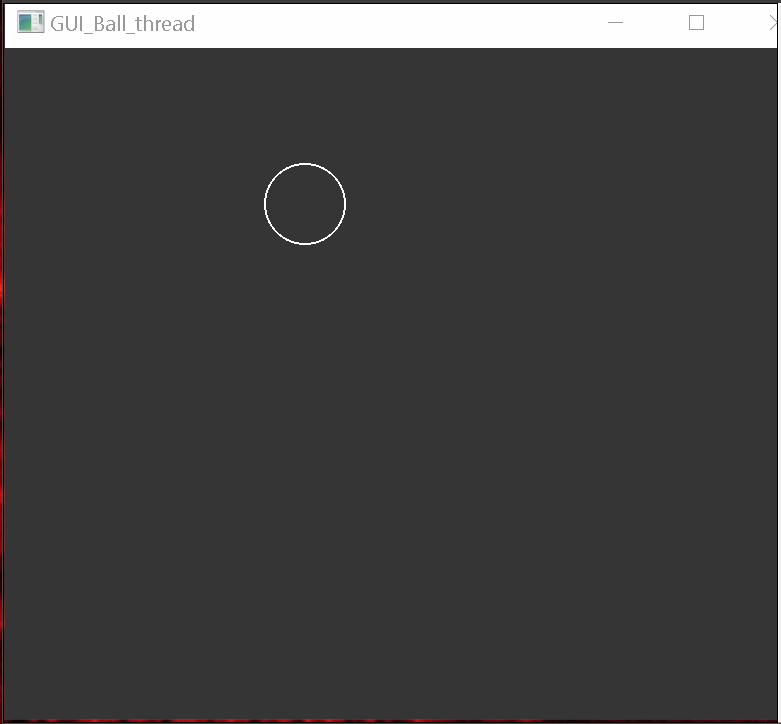

<!-- TITLE: QT Threading move Ball -->
<!-- SUBTITLE: 18.03.2018 Ball mit einem Thread in der GUI bewegen -->

# Infos



# Files

## Main
``` cpp
#include "widget.h"
#include <QApplication>
#include <QStyleFactory>

int main(int argc, char *argv[]) {
	QApplication a(argc, argv);
	///////////////////////////////////////////////////////////////////////
	// Nur für meine eigene Darstellung des GUIs
	//---------------------------------------------------------------------
	qApp->setStyle(QStyleFactory::create("fusion"));
	QPalette palette;
	palette.setColor(QPalette::Window, QColor(53, 53, 53));
	palette.setColor(QPalette::WindowText, Qt::white);
	palette.setColor(QPalette::Base, QColor(15, 15, 15));
	palette.setColor(QPalette::AlternateBase, QColor(53, 53, 53));
	palette.setColor(QPalette::ToolTipBase, Qt::white);
	palette.setColor(QPalette::ToolTipText, Qt::white);
	palette.setColor(QPalette::Text, Qt::white);
	palette.setColor(QPalette::Button, QColor(53, 53, 53));
	palette.setColor(QPalette::ButtonText, Qt::white);
	palette.setColor(QPalette::BrightText, Qt::red);
	palette.setColor(QPalette::Highlight, QColor(142, 45, 197).lighter());
	palette.setColor(QPalette::HighlightedText, Qt::black);
	qApp->setPalette(palette);
	//////////////////////////////////////////////////////////////////////////
	Widget w;
	w.show();
	return a.exec();
}
```
## Thread
### Thread.h

``` cpp
#ifndef THREAD_H
#define THREAD_H

#include <QThread>

class Widget;

class Thread : public QThread {
	Q_OBJECT
  public:
	Thread();
	void run();
  signals:
	void ThreadRun();
};

#endif // THREAD_H

```

### Thread.cpp

``` cpp
#include "thread.h"

Thread::Thread() {
}

/*!
 * \brief Thread::run
 *
 * QThread, wird hier als Taktgeber benutzt.
 */
void Thread::run() {
	//Endlosschleife im Thread
	while (true) {
		emit ThreadRun(); //Signal "ThreadRun()" auslösen
		msleep(20); //20 Millisec warten (nur in diesem Thread)
	}
}

```


## Widget
### Widget.h

``` cpp
#ifndef WIDGET_H
#define WIDGET_H

#include <QWidget>

class QPaintEvent;

class Widget : public QWidget {
	Q_OBJECT

  public:
	Widget(QWidget *parent = 0);
	~Widget();

	void paintEvent(QPaintEvent *event);
  private:
	int x, y, xSpeed, ySpeed, RADIUS;
  public slots:
	void move();
};

#endif // WIDGET_H

```


### Widget.cpp

``` cpp
#include "widget.h"
#include <QPaintEvent>
#include <QPainter>

#include "thread.h"

Widget::Widget(QWidget *parent)
	: QWidget(parent), x(100), y(100), xSpeed(20), ySpeed(20), RADIUS(40) {
	//--------------------------------------------------
	//Thread t erstellen
	Thread *t = new Thread();
	//Thread t starten
	t->start();
	//--------------------------------------------------
	QObject::connect(t, SIGNAL(ThreadRun()), this, SLOT(move()));
	QObject::connect(t, SIGNAL(ThreadRun()), this, SLOT(update()));
}

Widget::~Widget() {
}

/*!
 * \brief Widget::move
 * \details Slot move
 *
 * Hier ist die Logick von dem Ball, wie er sich bewegen soll.
 */
void Widget::move() {
	x = x + xSpeed;
	y = y + ySpeed;
	if (x + RADIUS > width() || x < 0) {
		xSpeed *= -1;
	}
	if (y + RADIUS > height() || y < 0) {
		ySpeed *= -1;
	}
}

/*!
 * \brief Widget::paintEvent
 * \param event
 *
 * Zeichnet den Ball
 */
void Widget::paintEvent(QPaintEvent *event) {
	QPainter painter(this);
	painter.drawEllipse(x, y, RADIUS, RADIUS);
}
```
